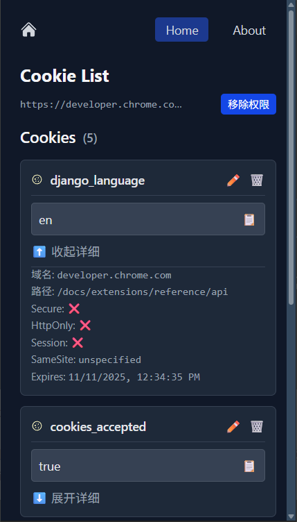
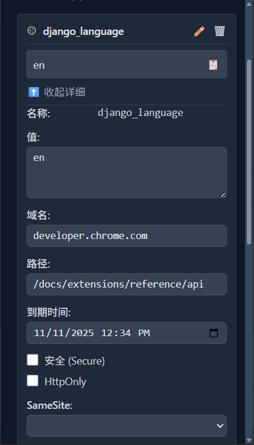

# WXT Cookies Manager

[](https://deepwiki.com/nuttycc/wxt-cookies) [](https://opensource.org/licenses/MIT) [](https://wxt.dev/) [](https://vuejs.org/) [](https://www.typescriptlang.org/)

一个现代化的浏览器扩展，用于查看和管理网站 Cookie。使用 Vue 3、TypeScript 和 WXT 框架构建，提供简洁直观的界面来检查和操作 Cookie。
## ✨ 功能特性

- 🍪 实时查看当前网站的 Cookie
- 🔍 详细的 Cookie 信息检查（名称、值、域、路径、过期时间等）
- 📋 复制 Cookie 值以便调试
- 🔒 权限管理，控制 Cookie 访问
- 🌓 支持明暗主题，自动检测系统偏好
- 🚀 响应式设计，适配不同尺寸的弹出窗口

## 📸 截图

<table>
  <tr>
    <td width="50%" align="center">
      <h4>主界面</h4>
      
    </td>
    <td width="50%" align="center">
      <h4>编辑 Cookie</h4>
      
    </td>
  </tr>
</table>

## 🚀 安装

### 开发环境

1. 克隆仓库
   ```bash
   git clone https://github.com/nuttycc/wxt-cookies.git
   cd wxt-cookies
   ```

2. 安装依赖
   ```bash
   pnpm install
   ```

3. 启动开发服务器
   ```bash
   # Chrome 开发模式
   pnpm dev
   
   # Firefox 开发模式
   pnpm dev:firefox
   ```

### 构建发布版本

```bash
# 构建 Chrome 版本
pnpm build

# 构建 Firefox 版本
pnpm build:firefox

# 打包为 zip 文件
pnpm zip
```

## 🛠️ 开发指南

### 项目结构

```
src/
├── assets/              # 静态资源
├── components/          # UI 组件
├── composables/         # 可复用逻辑
│   ├── useClipboard.ts  # 剪贴板操作
│   ├── useCookies.ts    # Cookie 管理
│   ├── useCookiePermission.ts # 权限处理
│   └── useCurrentTab.ts # 当前标签页管理
├── entrypoints/         # 扩展入口点
│   ├── background.ts    # 后台脚本
│   ├── popup/           # 弹出窗口 UI
│   └── welcome/         # 欢迎/引导页面
└── utils/               # 工具函数
    ├── logger.ts        # 日志工具
    ├── permissionOrigins.ts # 权限来源工具
    ├── settings.ts      # 设置管理
    └── theme.ts         # 主题管理
```

### 开发命令

- `pnpm dev` - 启动 Chrome 开发服务器
- `pnpm dev:firefox` - 启动 Firefox 开发服务器
- `pnpm build` - 构建生产版本
- `pnpm lint` - 检查并修复代码问题
- `pnpm format` - 格式化代码
- `pnpm compile` - 类型检查

## 📝 技术栈

- [WXT](https://wxt.dev/) - 浏览器扩展开发框架
- [Vue 3](https://vuejs.org/) - 渐进式 JavaScript 框架
- [TypeScript](https://www.typescriptlang.org/) - 类型安全的 JavaScript 超集
- [Tailwind CSS](https://tailwindcss.com/) - 实用优先的 CSS 框架
- [Pinia](https://pinia.vuejs.org/) - Vue 状态管理
- [VueUse](https://vueuse.org/) - Vue 组合式 API 工具集

## 🤝 贡献

欢迎提交 Issue 和 Pull Request。对于重大更改，请先开启 Issue 讨论您想要更改的内容。

## 📄 许可证

[MIT](LICENSE) © 2024 [nuttycc](https://github.com/nuttycc)


**实际上是个学习扩展开发的基本项目，功能很简陋。readme 随便由 AI 生成，看看效果。**
